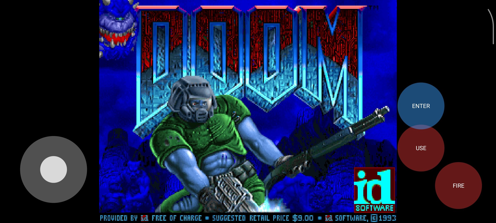

# Doom for Android — Native Port

  

A native Android port of the classic DOOM (shareware) built on top of
[doomgeneric](https://github.com/ozkl/doomgeneric). The engine is compiled
directly to ARM64 via the Android NDK and linked with the Java layer through
JNI. This is not an emulator — the game code runs natively on the device CPU.

## About the project

This project started as an experiment: how hard is it to take a piece of
open-source C code written for desktop platforms and make it run as a native
Android application, with a proper touch interface and no emulation layer.

The result is a working build of DOOM that runs on modern ARM64 Android
devices. It uses a virtual joystick for movement, on-screen buttons for
FIRE / USE / ENTER, and a software framebuffer that is blitted to a Bitmap
and rendered through SurfaceView.

## How it works

The architecture consists of three layers.

### Native engine (C)

The DOOM engine itself comes from doomgeneric, which is a portable
reimplementation of the original DOOM source code released by id Software.
All engine files are located in `app/src/main/cpp/doomgeneric/`. They are
compiled into a shared library called `libdoom.so`.

Two additional C files glue the engine to Android:

- `jni_bridge.c` — exposes JNI functions that the Java layer calls.
  It handles initialization, key events, and frame blitting.
- `doomgeneric_android.c` — implements the platform layer required by
  doomgeneric: `DG_Init`, `DG_DrawFrame`, `DG_SleepMs`, `DG_GetTicksMs`,
  `DG_GetKey`, `DG_SetWindowTitle`, plus the framebuffer blitting routine
  that copies `DG_ScreenBuffer` into an Android Bitmap.

Input events are pushed from Java into a thread-safe ring buffer and
consumed by the engine on its own game thread.

### Java layer

The Android side contains:

- `MainActivity` — sets up the view hierarchy, copies the WAD file from
  assets to internal storage, and starts the native engine.
- `DoomSurfaceView` — a SurfaceView that owns the 640x400 Bitmap used
  as the framebuffer target. Frames are requested through Choreographer
  and blitted to the screen.
- `TouchControlsView` — draws the virtual joystick and buttons on top of
  the game surface, and translates touch events into DOOM key codes.
- `DoomLib` — static native method declarations that match the JNI
  functions in `jni_bridge.c`.
- `DoomKeys` — key code constants mirrored from `doomkeys.h`.

### Communication

Java and C communicate exclusively through JNI. There is no shared memory,
no Binder, no AIDL. The Java layer calls native methods directly, and the
native engine calls back into Java only where necessary (currently it
does not need to).

## Building

### Requirements

- Android Studio or AndroidIDE
- Android NDK (r27 or newer recommended)
- CMake 3.22 or newer
- A device or emulator running Android 10 (API 29) or later
- The shareware WAD file `doom1.wad`

### Steps

1. Clone the repository.

2. Place `doom1.wad` into `app/src/main/assets/`.

   The WAD is not included in this repository for licensing reasons.
   The shareware version can be downloaded freely from various public
   archives.

3. Build the APK.

4. Install on a connected device.

### Notes on the build

The native library is built with CMake through Gradle's
`externalNativeBuild` integration. The `doomgeneric` sources are filtered
so that platform backends for other systems (SDL, Allegro, X11, Windows,
Emscripten, and so on) are excluded from the build. Only the Android
backend is compiled.

A post-build step runs `align_tls.py` on the resulting `libdoom.so` to
fix TLS segment alignment, which is required for the library to load
correctly on Android's Bionic linker.

## Controls

The touch interface provides:

- A virtual joystick on the left side that maps to the arrow keys.
- A FIRE button on the lower right.
- A USE button above it.
- An ENTER button for menu navigation.

The controls are implemented as a single custom View that draws itself
over the game surface and forwards touch events to the native engine.

## Why the engine is not built through CMake

During development, building doomgeneric through CMake inside Gradle's
native build pipeline led to TLS alignment issues on ARM64. The library
compiled and linked successfully, but Android's dynamic linker refused to
load it because the TLS segment was not aligned to a power of two.

To work around this, the library is compiled separately using a plain
Makefile (located in `~/doom_build/Makefile` during development), then
the resulting `libdoom.so` is placed into `app/src/main/jniLibs/arm64-v8a/`
and picked up by Gradle as a prebuilt shared library. The CMakeLists.txt
is retained but the native build step is disabled in `build.gradle`.

This is not the most elegant setup, but it works reliably and is easy
to reproduce.

## License

The source code in this repository is distributed under the GNU General
Public License version 2, the same license used by doomgeneric and the
original DOOM source release from id Software.

The shareware WAD file `doom1.wad` is not covered by the GPL. It is
property of id Software and is redistributed under the terms of the
id Software Limited Use Software License Agreement, which permits free
redistribution in its original, unmodified form, provided that no fee
is charged for its receipt or use.

DOOM is a trademark of id Software LLC. This is an unofficial,
non-commercial fan project and is not affiliated with or endorsed by
id Software, ZeniMax, or Bethesda Softworks.

## Acknowledgements

- id Software for creating DOOM and releasing the source code.
- The doomgeneric project for providing a portable base.
- The Android NDK team for making native development on Android
  practical.

## Status

The port is playable from start to finish on the shareware episode.
Movement, shooting, doors, and menu navigation all work. The interface
is functional but minimal: there is currently no audio, no gamepad
support, and no on-screen layout customization.

Further development may add audio through AAudio or OpenSL ES, ESCAPE
and TAB buttons, configurable button positions, and support for external
controllers.

## Author

CanavarIT — [github.com/CanavarIT](https://github.com/CanavarIT)
